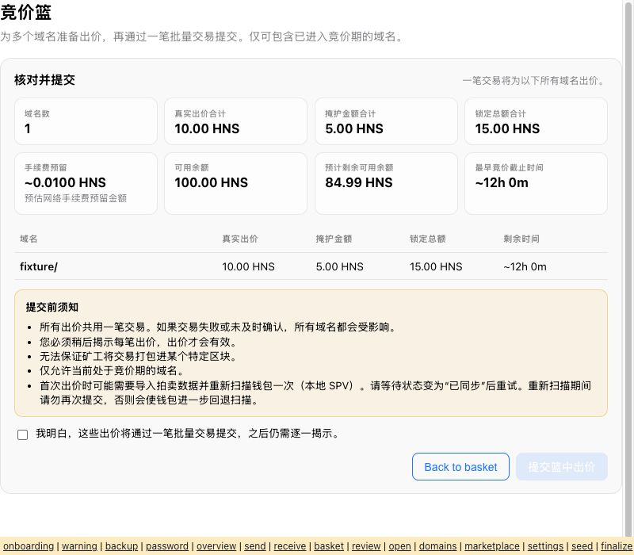
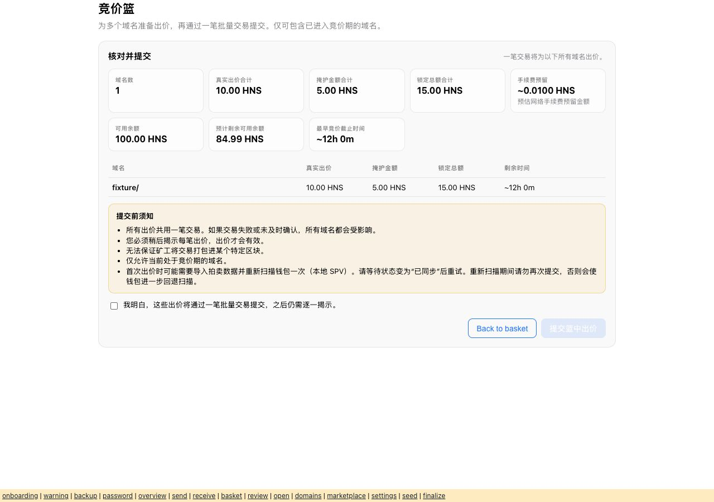
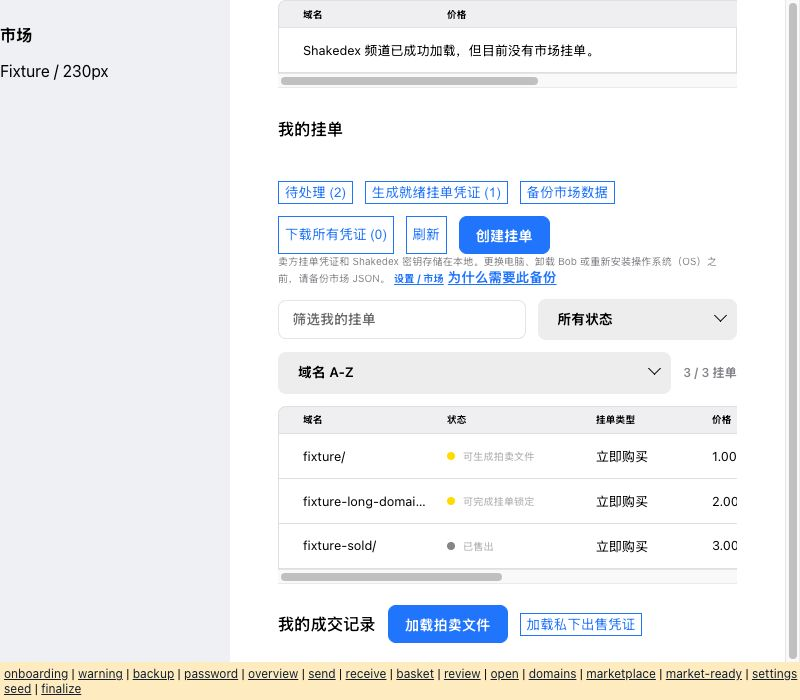
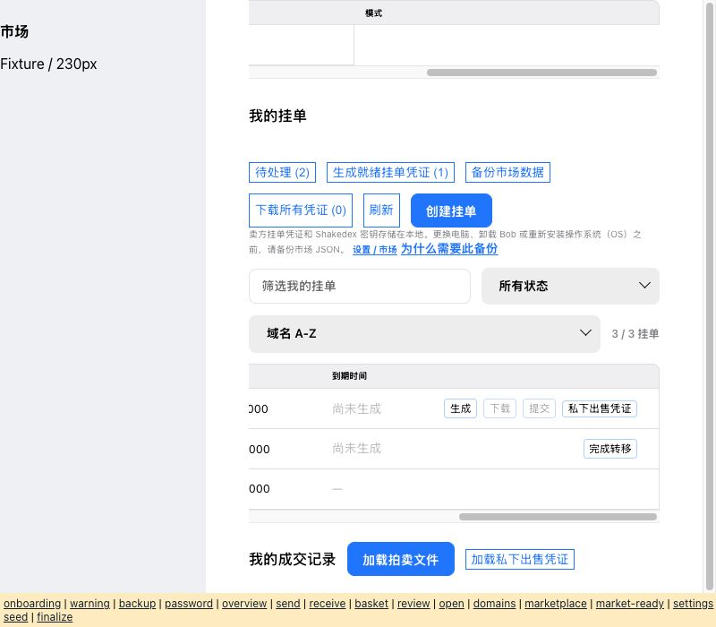
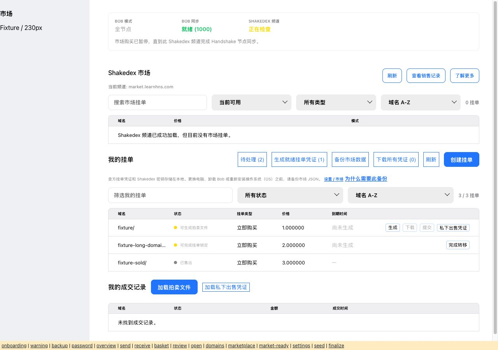
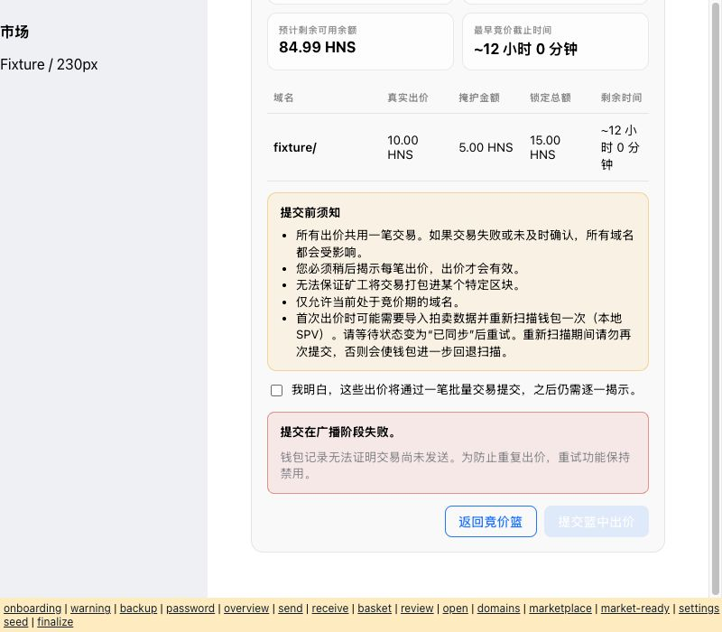

# zh-CN review record — 2026-10-02

Base: `7781df159fbb7bd4426e5e0ac877b7fdd195d4ca` (master).
Scope: existing draft PR #9; no merge, tag, signed package, release, or deployment.

## Automated evidence

- 1,193 English keys and 1,193 Chinese keys; no duplicate, missing, or extra keys.
- Only five intentionally unchanged values: SPV, API, Shakedex, em dash, URL.
- `%s` counts and `%s%` literal-percent markers pass; placeholder arguments
  remain in source order, including the M-of-N signature policy.
- URLs and known technical identifiers pass the strengthened locale CLI.
- 12 CLI regression cases pass (valid translation plus missing/obsolete keys,
  missing/duplicated placeholders, literal percent, URL, identifier, markup,
  newline, empty value, and non-string value mutations).
- Full `npm test`: 649/649 assertions pass.
- Local fixture webpack compilation and `git diff --check` pass.

## Separate safety pass

This was a second pass by the same translation agent, not an independent human
or native-speaker approval. Review covered these English/Chinese key groups:

| Topic | Representative keys and verified meaning |
| --- | --- |
| Seed phrase | `backupWarning*`, `obBackupSeed*`, `obImport*`, `phraseMismatch*`, `seedCopy*`, `revealSeed*`, `removeWalletAck*`: preserve loss/phishing/clipboard warnings; seed restore does not restore local settings, watchlists, or market files; showing a seed is 显示. |
| Private keys and passwords | `backupListingWarning*`, `obImportOption2/3*`, `obImportSeedWarning*`, `settingAccountKey*`, `obCreatePassword*`: distinguish encrypted private-key backups, public account access, password requirements, and unchanged key prefixes. |
| Construct/sign/broadcast | `createNewTransaction`, `sign*`, `multisigTx*`, `txView*`, `broadcast`, `storageError*`: construction, signature sufficiency, completeness, broadcast, and confirmation remain distinct; uncertain submission stays uncertain. |
| Bid/blind | `bid*`, `blind*`, `basket*`, `openBasket*`: true bid plus blind equals lockup; OPEN is not BID; all batch bids share one transaction; subsequent reveal is mandatory. |
| Reveal/redeem/register | `reveal*`, `redeem*`, `register*`, `repairBid*`, `overviewAction*`: deadline/loss risk retained; losing bids are redeemed; winning names are registered; seed alone cannot recover hidden bid amounts. |
| Transfer/finalize | `transfer*`, `finalize*`, `bulkFinalize*`, `claimNamePayment*`, `shakedexStatus*`: submitting transfer is not completing transfer; recipient address warning says 接收方; cancellation and finalization stay separate. |
| Marketplace proofs | `generateListingProof*`, `submitListingProofHelp`, `privateSale*`, `learnHnsSeller*`, `proofBackupWarning`: local signing, channel publication, and on-chain transfers are distinct; anyone holding a private proof can buy; old proofs may remain usable. |
| Irreversibility and recovery | `revoke*`, `zap*`, `receiveModalWarning*`, `hip2*`: permanent loss, irreversible revocation, pending transactions remaining on the network, and “do not send” security failures are retained. |

No secrets were entered or generated. No real transactions were constructed,
signed, or broadcast. Existing automated tests use their mocks/fixtures;
visual review used only the inert local component renderer.

## Visual review

Reviewed actual component markup/styles in the in-app browser at **800×700**
and **1280×900** using the fixture tool in `scripts/locale-preview`:

- Onboarding welcome, restore warning/scope, backup warning, password setup.
- Overview including populated reveal/register/redeem action cards.
- Send form and receive safety warning.
- Auction Basket empty state and populated review with 10 HNS bid, 5 HNS blind,
  15 HNS lockup, 0.01 HNS fee reserve, and 84.99 HNS estimated remainder.
- Open Basket, Domain Manager empty state, Marketplace seller-list state.
- General Settings, seed-display password prompt, paid-transfer finalize dialog.

Reviewed Chinese warnings and buttons wrap legibly at these sizes. This is
partial screen-state coverage: it does not exercise a real app session,
hardware wallet, populated market sale, all transaction dialogs, dark theme,
or every error state. The fixture port does not mount React lifecycles or
connect to services. Portal contents are rendered inline with original styles.

### Follow-up review and remaining gates

The 101 newly extracted keys cover the documented Send tabs/fee labels, General
Settings appearance/USD controls, Add Ons navigation, expiry/pagination/duration
labels, proof publication confirmation, and Auction Basket import, draft, split,
construction, signing, broadcast, verification, failure, and retry states.
Internal fee identifiers, protocol states, CSV schema, and numeric validation
are unchanged. Other source text and backend-provided errors can remain English;
this is not a claim that every application screen is fully localized.

The narrow Marketplace filter count now wraps inside the content pane. Search
fields expand, empty/loading messages span the table, and populated columns use
internal horizontal scrolling. Domain Manager search/filter sizing was corrected.
Follow-up browser inspection used 800×700 and 1280×900 with a synthetic 230px
sidebar and actual content styles for Marketplace, Send, Domain Manager, and
Auction Basket. Settings follows its real route without the main sidebar/padding.
The fixture omits the real topbar; this is component/layout review, not full app QA.
Reviewed both left/right Marketplace column positions and the lower uncertain
broadcast warning. The warning wraps, says the result is unproven, and keeps
retry disabled. Screenshots below record these views.

A fresh source-context safety pass checked the new phase translations separately:
construction/signing retain “not sent”; broadcasting/verifying do not assert that;
uncertain failure does not promise safe retry; successful broadcast does not claim
chain confirmation; publishing a proof does not claim to send an on-chain transaction.
Added mock/static-render tests verify these distinctions and translated parser
errors without changing parsed amounts or rejection counts. This is still the
same agent's review, not an independent native-speaker acceptance.

Open gates: independent native Simplified Chinese safety/visual approval and
validation against the eventual release head. The selector remains disabled and
PR #9 remains a draft. See [the volunteer checklist](zh-CN-native-review.md).
Additional dialogs, populated market purchases, hardware wallets, dark theme,
and backend errors still need broader release QA.

The historical airdrop/auction descriptions remain translations of the current
English source; this PR does not independently revise their factual content.

### Saved fixture screenshots

### Follow-up screenshots

> Decision update, 2026-10-02: The maintainer approved merging PR #9 and enabling
> Simplified Chinese for the next planned build. Independent native-speaker
> feedback is deferred until that build is available. Earlier disabled-selector
> and pre-merge native-review requirements below are historical and superseded
> by this decision. Native approval has not been claimed; release-head testing
> and follow-up wording corrections remain outstanding. No public build is
> authorized by this change.
