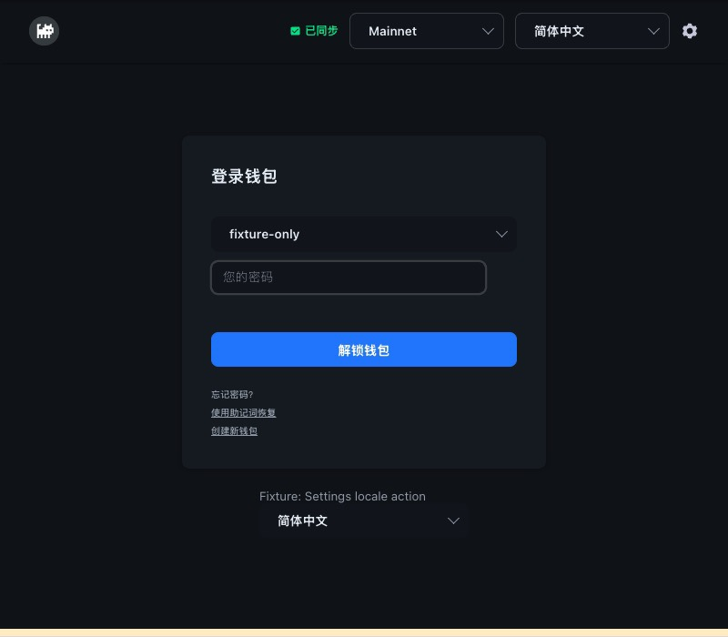
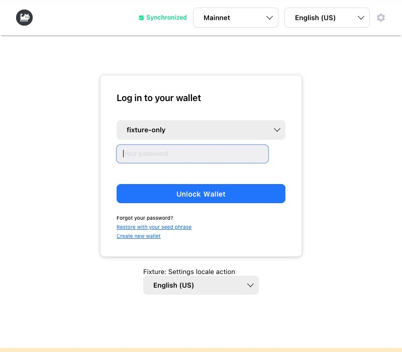
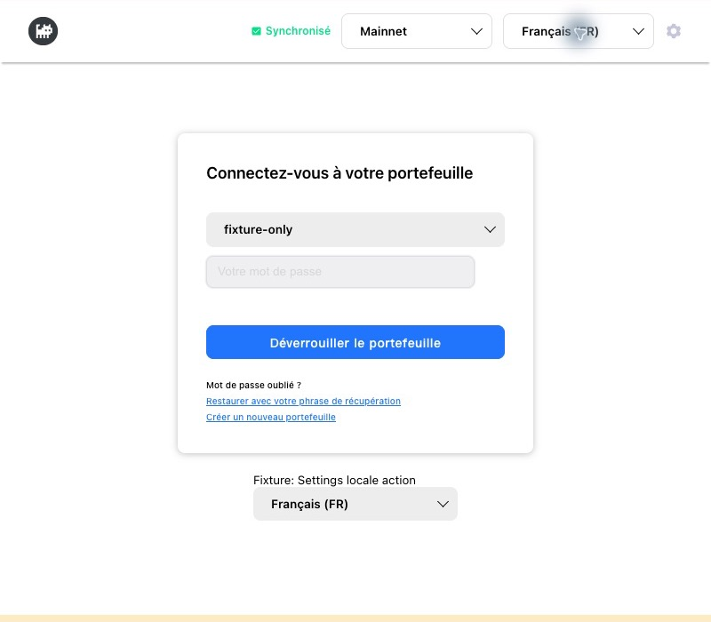
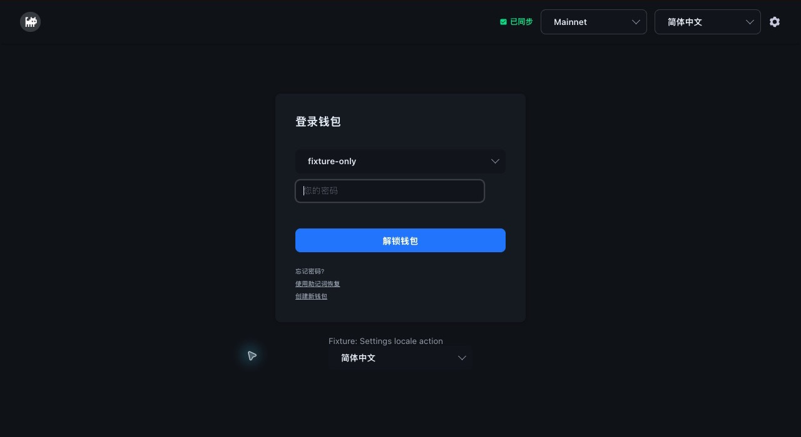
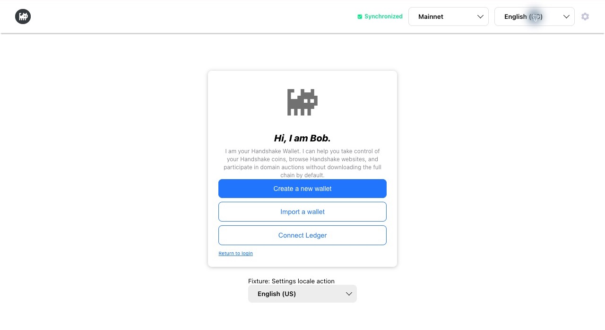
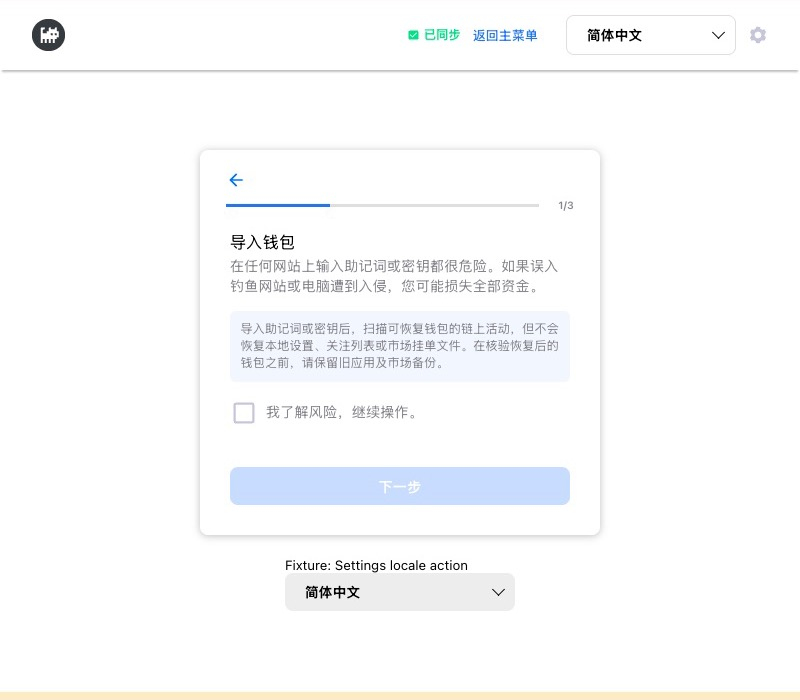

# Logged-out language selector review — 2026-10-03

Base: master `0c66695f3cec4c47af4d519b8f052df5701d2736`.
Scope: shared logged-out AppHeader (login, first-run, create and restore).
The logged-in Topbar is unchanged.

## Behavior

The predefined language selector follows Mainnet (or the existing Return to Menu
control during onboarding) and precedes the Settings gear. It shares Settings'
options and `setLocale` thunk, settings IPC persistence and Redux state. French
now uses its native name, Français. The opt-in native-select mode of Dropdown
retains value/index callback semantics and shared styling, and provides native
keyboard/type-ahead, focus, and accessibility behavior. Existing dropdown users
remain unchanged.

Custom JSON import stays in Settings. When custom is active the header represents
it as a selected, disabled Custom JSON option, alongside usable predefined options;
it never offers a broken import action. Choosing a predefined language clears
custom state through the existing persistence route. Settings now catches async
save/import failures instead of leaving an unhandled rejection.

Startup hydration is read-only, validates custom data, falls back to English for
missing/unsupported/corrupt preferences, and cannot overwrite a newer selection.
The login route uses a stable component identity so App context rerenders do not
remount its form. A regression mounts the actual App route form subtree, checks
the same DOM input and typed state survive, and confirms text updates in place.

Header and Settings writes are serialized to keep persisted and displayed order
consistent. The header shows a save error and retains the last committed selection
on rejection. No network, node, wallet, rescan, routing, or form-reset action is
part of a language change.

## Verification

- Full `npm test`: **776/776 assertions pass**, process exits successfully.
- zh-CN parity/token/placeholder/format validation: **1,278/1,278 keys pass**.
- Locale-validator regression suite: **12/12 pass**.
- Production renderer compilation, interactive fixture compilation and
  `git diff --check` pass. No installer/public binary was built.
- Regression cases cover fresh-store restart hydration, no writes during startup,
  corrupt/unknown fallback, custom/predefined transitions, early selection versus
  delayed startup, failed save, queued Settings/header writes, shared selection,
  current-custom representation, retry availability, and sibling form retention.
- The Node/jsdom harness uses a timer-backed MessageChannel because React's
  browser scheduler otherwise leaves a referenced Node port alive after unmount.

Interactive browser checks used only synthetic wallet labels and mock locale
preferences in this localhost origin. Wallet/node IPC, file operations, fetch,
XHR and WebSocket are blocked. No actual profile or wallet service was opened.

- Inspected English and Chinese at 800×700 and 1280×900 iframe viewports;
  light/dark views; Français (the longest predefined label) at both widths.
- Selector, network/status and gear do not overlap. Shared create/restore and
  first-run headers remain accessible; Return to Menu is localized.
- Keyboard Home/End/Arrow/Enter changed locale using the native control.
- Actual login and create-password fixture fields retained synthetic typed input
  across locale changes without submitting or navigating.
- The Settings-side fixture dispatches the same production action: changing it
  updates the header, and header changes update it. Reloading the fixture restores
  the mocked saved preference. A mocked rejected save keeps the prior language
  and shows the translated error.

Limits: this is browser/component and mocked-persistence validation, not an
installed Electron app restart against a real profile, OS screen-reader audit,
or wallet/node lifecycle test. The Settings-side fixture uses the shared action,
not the full Settings page/import file picker. Existing native Settings import
flow remains in place. No real transaction or credential was used.

## Reproduce safely

```sh
./node_modules/.bin/webpack --config scripts/login-language-preview/webpack.config.js
python3 -m http.server 8140 --bind 127.0.0.1 --directory test-dist/login-language-preview
```

Open `/800-light-login.html`, `/800-dark-login.html`, or their `1280` counterparts.
Use `create`, `restore`, or `welcome` in place of `login`. The mock preference is
stored under `bob-header-fixture-locale` in localhost browser storage only.
`/?fail=1&theme=dark` rejects mock preference writes. Wallet actions are blocked;
do not try to submit any form. Stop the server when finished.

Screenshots are cropped to fixture content, excluding unrelated browser tabs.
Wide screenshots show the top 700px of the 1280×900 viewport.








Integration: other active branches may append English/Chinese keys or unit imports.
Retain both sets of additions when integrating; do not overwrite those branches.
This PR changes only `headerLanguageSaveError` and `headerReturnToMenu` locale keys.
No merge, signing, tag, public artifact or release is performed here.

Separate follow-up: the More Addons catalog remains partially untranslated.
Arthur’s reported ShakeX Chinese/English acceptance does not constitute independent
native-speaker review, and this header PR does not expand catalog localization.
